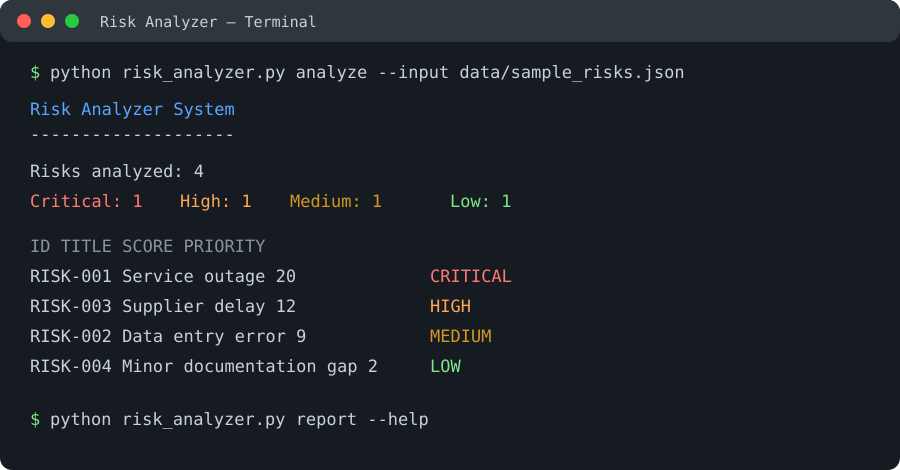

# Risk Analyzer System

## 1. Project Title

**Risk Analyzer System**

## 2. Project Overview

Risk Analyzer System is a complete command-line application for identifying, evaluating, prioritizing, and reporting operational risks. It is designed to help a user maintain a structured list of risks and make consistent decisions based on two measurable factors: likelihood and impact.

The application calculates a risk score by multiplying likelihood by impact. It then assigns a priority level, sorts risks from most urgent to least urgent, and produces reports that can be viewed in the terminal or saved as JSON, CSV, or text files.

The project is intentionally implemented using only Python and its standard library. It does not require a web browser, graphical user interface, database server, external API, or third-party package. This makes it easy to install, inspect, execute, and evaluate from a terminal.

### How the source code works

The source code is separated into focused Python modules so that each part of the application has a clear responsibility:

- `risk_analyzer.py` is the command-line entry point. It reads command-line arguments, selects the requested operation, loads input data, and displays or saves results.
- `risk_models.py` defines the risk data model and validation rules. It ensures that required fields exist and that likelihood and impact values are within the accepted 1–5 range.
- `risk_engine.py` contains the analysis logic. It calculates scores, maps scores to priority bands, counts priorities, and sorts risks by urgency.
- `risk_io.py` handles reading JSON and CSV input files and writing JSON, CSV, and text reports.
- `config.json` stores the scoring thresholds, allowing priority rules to be adjusted without editing Python source code.
- `data/sample_risks.json` provides realistic sample records that can be used immediately after cloning the project.
- `tests/` contains automated tests using Python's built-in `unittest` framework.

The normal processing flow is:

1. The user runs a command in the terminal.
2. The CLI validates the command and its options.
3. The input loader reads a JSON or CSV file.
4. Each record is converted into a validated risk object.
5. The analysis engine calculates `likelihood × impact`.
6. The score is converted into Low, Medium, High, or Critical priority.
7. Results are printed or exported in the requested format.

## 3. Features

- Command-line execution using `.py` files.
- Add a risk interactively from the terminal.
- Analyze risks loaded from JSON or CSV files.
- Calculate a numerical score from likelihood and impact.
- Classify risks as Low, Medium, High, or Critical.
- Sort risks from highest score to lowest score.
- Store risk title, description, category, owner, status, and mitigation plan.
- Validate required values and reject invalid scores.
- Generate terminal summaries and detailed reports.
- Export results as text, JSON, or CSV.
- Configurable priority thresholds.
- Sample data for demonstration.
- Automated tests without third-party dependencies.
- Cross-platform operation on Windows, macOS, and Linux.

## 4. Technologies and Tools Used

- **Python 3.10+** — implementation language.
- **Python standard library only** — no external runtime dependencies.
- `argparse` — command-line argument parsing.
- `dataclasses` and `enum` — structured risk objects and priority values.
- `json` — JSON input and output.
- `csv` — CSV input and output.
- `pathlib` — portable file and directory handling.
- `datetime` — report timestamps.
- `unittest` — automated testing.
- **Git and GitHub** — source-code version control and project hosting.

No `pip install` command is required because the project uses only modules included with Python.

## 5. Installation and Setup

### Prerequisites

Install Python 3.10 or newer. Check the installed version:

```bash
python --version
```

On systems where the executable is named `python3`, use:

```bash
python3 --version
```

### Clone the repository

```bash
git clone https://github.com/Shrustirmr/risk-analyzer-system.git
cd risk-analyzer-system
```

### Optional virtual environment

A virtual environment is optional because there are no external dependencies, but it can keep the project isolated.

Windows:

```bash
python -m venv .venv
.venv\\Scripts\\activate
```

macOS/Linux:

```bash
python3 -m venv .venv
source .venv/bin/activate
```

There is no dependency installation step. The standard library is sufficient.

## 6. Running the Project

Display the command-line help:

```bash
python risk_analyzer.py --help
```

Analyze the included sample data:

```bash
python risk_analyzer.py analyze --input data/sample_risks.json
```

Generate a text report:

```bash
python risk_analyzer.py report --input data/sample_risks.json --output reports/risk-report.txt --format text
```

Generate a JSON report:

```bash
python risk_analyzer.py report --input data/sample_risks.json --output reports/risk-report.json --format json
```

Generate a CSV report:

```bash
python risk_analyzer.py report --input data/sample_risks.json --output reports/risk-report.csv --format csv
```

Analyze a CSV input file:

```bash
python risk_analyzer.py analyze --input data/risks.csv --format csv
```

Add a risk interactively:

```bash
python risk_analyzer.py add
```

### Risk scoring rules

Each likelihood and impact value is from 1 to 5:

- Likelihood: 1 means rare and 5 means almost certain.
- Impact: 1 means insignificant and 5 means severe.

The score is calculated as:

```text
risk score = likelihood × impact
```

The default priority bands are:

| Score | Priority |
|---:|---|
| 1–4 | Low |
| 5–9 | Medium |
| 10–16 | High |
| 17–25 | Critical |

The thresholds are stored in `config.json` and can be changed as project policy evolves.

## 7. Input Data Format

A JSON input record has the following structure:

```json
{
  "id": "RISK-001",
  "title": "Service outage",
  "description": "A dependency may become unavailable during peak usage.",
  "category": "Operational",
  "likelihood": 4,
  "impact": 5,
  "owner": "Operations Team",
  "status": "Open",
  "mitigation": "Add monitoring, failover capacity, and an incident runbook."
}
```

The same fields can be represented as columns in a CSV file. `id`, `title`, `likelihood`, and `impact` are the key fields required for scoring; the other fields provide context for reporting and mitigation planning.

## 8. Testing Instructions

Run all tests from the repository root:

```bash
python -m unittest discover -s tests -p "test_*.py" -v
```

If your system uses `python3`, run:

```bash
python3 -m unittest discover -s tests -p "test_*.py" -v
```

The test suite checks score calculation, priority classification, validation, data loading, report output, and risk ordering. A successful run displays each test as `ok` and ends with an overall success summary.

## 9. Screenshots and Example Output

The repository includes a terminal preview at [`docs/assets/cli-demo.svg`](docs/assets/cli-demo.svg). It shows the command-line analysis workflow and a prioritized risk table.



Example terminal output:

```text
$ python risk_analyzer.py analyze --input data/sample_risks.json
Risk Analyzer System
--------------------
Risks analyzed: 4
Critical: 1 | High: 1 | Medium: 1 | Low: 1

ID        TITLE                    SCORE  PRIORITY
RISK-001  Service outage           20     CRITICAL
RISK-003  Supplier delay           12     HIGH
RISK-002  Data entry error           9     MEDIUM
RISK-004  Minor documentation gap   2     LOW
```

## 10. Project Structure

```text
risk-analyzer-system/
├── risk_analyzer.py
├── risk_engine.py
├── risk_models.py
├── risk_io.py
├── config.json
├── data/
│   └── sample_risks.json
├── reports/
├── tests/
│   ├── test_engine.py
│   └── test_io.py
├── docs/
│   └── assets/
│       └── cli-demo.svg
└── README.md
```

## 11. Limitations and Future Improvements

The current version is a local file-based command-line tool. It does not provide authentication, multi-user collaboration, a hosted database, or live integrations. Future improvements could include historical trend analysis, database persistence, scheduled reports, and a web dashboard while keeping the analysis engine reusable.

## 12. License and Academic Use

This project is provided for educational and demonstration purposes.
